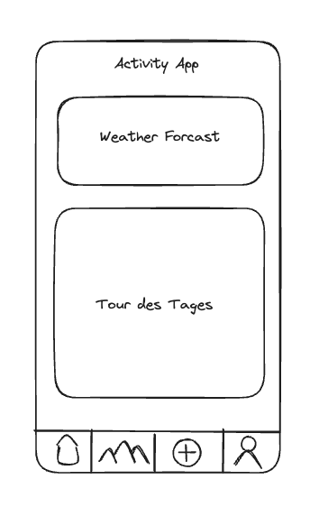

## Value proposition
As a outdoor enthusiast  
I want to see an activating Spotlight  
In order to get inspired to explore a fresh outdoor activity

## Description

## Acceptance criteria
- [ ] Opening the app you will see a spotlight page
- [ ] Above the spotlight you can see the app title or logo
- [ ] The spotlight page displays an weather forcast
- [ ] ... and also includes a random "activity of the day" in form of an teaser-image
- [ ] A navigation bar is shown at the bottom of the page
- [ ] The Navbar consists of: homepage icon, category overview icon, add activity icon, profile icon
## Tasks
- [ ] Creat a next.js page
- [ ] A title via a h1
- [ ] Fetch Weather API on _app.js (whatever is global)
- [ ] Create the necessary means to work with Components
- [ ] Display the current weather on the spotlight page
- [ ] For now use the provided list for activities and add more at will
- [ ] Pick one of the provided activities at random, use the maping method to display title and image
- [ ] Create a basic navbar component to display the icons named above (check usage of  ...children)
