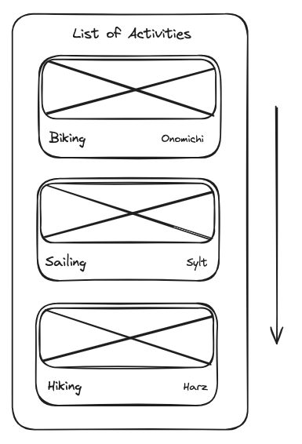

# List Overview

## Value Proposition

**As a** user,

**I want to** see a list of all activities,

**so that** I find inspiration for my next activities.

## Description

## Acceptance Criteria

- A proper headline introduces the content of the site
- A list of all existing activities is displayed
- The main important information per activity is displayed (e.g. title and location)
- The list scrolls vertically

### Tasks

- [ ] Create feature branch `feature/list-overview`
- [ ] Create ActivityCard-component with props 'key value: id', 'image', 'title', 'area'
- [ ] Import `dummydata.json`
- [ ] Create a an unordered list and map over dummy data
- [ ] Display each activity in a ActivityCard in a list at the HomePage
- [ ] Create `<h1>` headline with text `List of activities`
